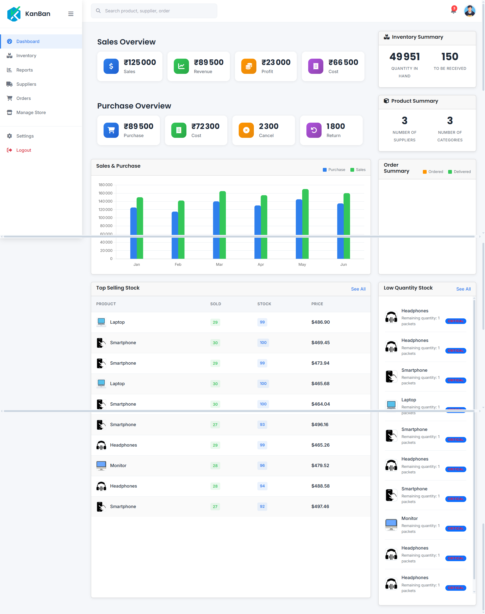
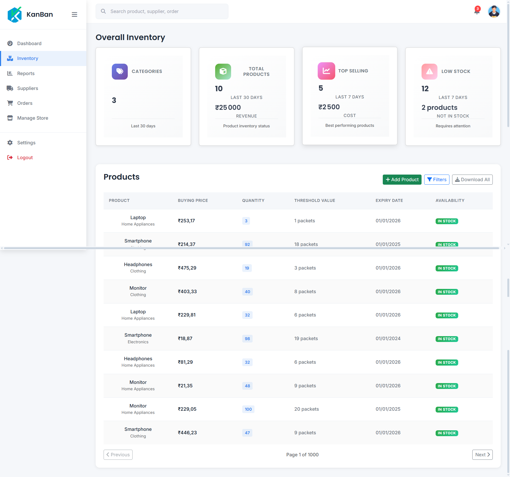
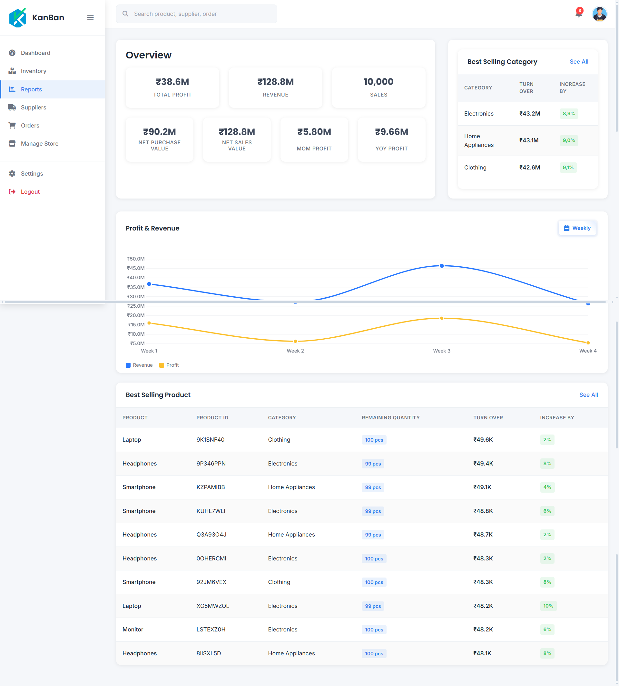

# KanBan-Project (v1)

Un tableau de bord moderne de gestion d’inventaire et d’analytique, bâtie sur .NET 8 (ASP.NET Core Web API) et un front-end React + Vite + TypeScript. Le projet inclut un service d’import CSV robuste, un repository en mémoire, et des visualisations (Chart.js) pour suivre la santé de votre stock.

- Backend: ASP.NET Core 8, API REST, Swagger, DI, repository générique InMemory, services métier (produits, dashboard, import CSV)
- Frontend: React 18, Vite 4, TypeScript, Bootstrap/React-Bootstrap, Chart.js (react-chartjs-2), Axios, UI moderne
- Import: Outil d’import CSV (console et API multipart) avec mapping explicite, validation et métadonnées

Badges: .NET 8 • React 18 • Vite 4 • TypeScript

## Captures d’écran

  
   
  <em>Dashboard — aperçu global, tendances, répartitions par catégorie/statut.</em>
    
  
   
  <em>Inventory — table des produits, filtres, métriques d’inventaire.</em>
    
  
   
  <em>Reports — indicateurs d’affaires, meilleures catégories/produits, graphiques.</em>

## Sommaire

- Présentation
- Architecture & Dossiers
- Démarrage rapide (dev)
- Build & Production
- Endpoints API (Swagger)
- Import CSV (format & options)
- Scripts & commandes utiles
- Roadmap (idées d’évolution)
- Auteur

## Présentation

Ce projet fournit:

- Un Web API .NET 8 exposant des endpoints pour produits, dashboard (métriques/analytics), et rapports.
- Un front-end React moderne (Vite) consommant l’API via un proxy, avec des pages: Dashboard, Inventory, Reports.
- Un service d’import CSV générique reposant sur CsvHelper, avec mapping de colonnes, validation, et retour d’un ImportResult riche (succès, erreurs, durée, métadonnées).

## Architecture & Dossiers

- Inventory.Core (librairie métier)

  - Contracts: interfaces d’entités et services (IInventoryItem, ICsvService, etc.)
  - Entities: Product, Order (+ OrderItem)
  - Enums: ProductStatus, OrderStatus, etc.
  - Collections:
    - GenericCollection<T,TKey>: dictionnaire concurrent, accès par clé, requêtage simple
    - InventoryCollection<Product>: indexations multiples (par Id, SKU, catégorie, localisation, statut) et helpers (WhereLowStock, TotalValue, …)
  - Repositories: GenericRepository/InMemoryRepository (pour démonstration)
  - Services:
    - ProductService: CRUD, import/export CSV, requêtes par catégorie/stock
    - DashboardService: agrégations (métriques, analytics, tendances, alertes réassort)
    - CsvService<T,TKey>: import/export CSV + validation

- Inventory.Import (outil console d’import)

  - IImportService & ImportService: logique d’import fichier/flux avec validation, temps d’exécution, gestion d’erreurs/avertissements
  - Program.cs: CLI Usage: Inventory.Import <csv-file-path>

- Inventory.WebUI (Web API .NET + hébergement du back)

  - Program.cs: DI, Swagger, CORS, initialisation des données
  - Controllers: DashboardController, ProductsController, ReportsController
  - Services: DataInitializationService (seed à partir d’un CSV ‘import/products.csv’ ou données de fallback)
  - ClientApp (front React + Vite)
    - src/pages: Dashboard, Inventory, Reports, Analytics
    - src/components: composants UI (StatsCards, charts, tables, sidebar…)
    - src/services/api.ts: Axios configuré sur baseURL /api
    - src/utils, src/hooks, src/contexts
    - vite.config.ts: build vers ../wwwroot/dist et proxy /api -> http://localhost:5000

- screenshots: images utilisées dans ce README

## Démarrage rapide (développement)

Prérequis:

- .NET SDK 8.0+
- Node.js 18+ et npm

1. Installer les dépendances front-end

- Ouvrir un terminal dans Inventory.WebUI/ClientApp
- npm install

2. Lancer le backend (API)

- Dans un autre terminal à la racine du projet ou dans Inventory.WebUI:
- dotnet run --project Inventory.WebUI
- Par défaut, Vite pointe sur http://localhost:5000 pour le proxy. Si votre API n’écoute pas sur 5000, définissez ASPNETCORE_URLS=http://localhost:5000 avant de lancer.

3. Lancer le front-end (Vite dev server)

- Dans Inventory.WebUI/ClientApp:
- npm run dev
- Ouvrez http://localhost:3000 (les requêtes /api sont proxifiées vers l’API en 5000)

4. Explorer la documentation API

- Avec le backend en cours d’exécution, rendez-vous sur http://localhost:5000/swagger

Astuce: si vous avez un fichier de seed CSV, placez-le dans import/products.csv (à la racine Inventory.WebUI) avant de lancer l’API: DataInitializationService l’importera automatiquement.

## Build & Production

- Build front-end (génère les assets dans Inventory.WebUI/wwwroot/dist):
- cd Inventory.WebUI/ClientApp
- npm run build

- Build backend:
- dotnet build

Remarque: L’API ne sert pas encore les fichiers statiques du dossier wwwroot/dist (UseStaticFiles non configuré). En production, il est recommandé soit:

- de servir le front via un serveur statique (NGINX, CDN) et faire pointer le front vers l’API,
- ou d’activer app.UseStaticFiles() + fallback SPA côté ASP.NET et héberger le build Vite dans wwwroot.

## Endpoints API (extrait)

Base URL: /api

- Dashboard

  - GET /api/dashboard -> données agrégées (totaux, répartitions, tendances)
  - GET /api/dashboard/metrics
  - GET /api/dashboard/analytics/categories
  - GET /api/dashboard/analytics/locations
  - GET /api/dashboard/trends/value?days=30
  - GET /api/dashboard/alerts/restock
  - GET /api/dashboard/stats/summary

- Products

  - GET /api/products?page=1&size=10
  - GET /api/products/{id}
  - POST /api/products (JSON Product)
  - PUT /api/products/{id}
  - DELETE /api/products/{id}
  - POST /api/products/import (multipart/form-data, champ: file)

- Reports
  - GET /api/reports
  - GET /api/reports/overview
  - GET /api/reports/categories/best-selling
  - GET /api/reports/products/best-selling
  - GET /api/reports/chart-data?period=weekly|monthly

Swagger: http://localhost:5000/swagger

## Import CSV

Deux voies:

- via l’API: POST /api/products/import (multipart/form-data) avec file = votre.csv
- via l’outil console: Inventory.Import <path-vers-votre.csv>

Le mapping (ProductCsvMap) attend des en-têtes similaires aux colonnes suivantes (exemples):

- "Product ID" -> SKU
- "Product Name" -> Name
- "Product Category" -> Category
- "Product Description" -> Description
- "Price" -> Price
- "Stock Quantity" -> Quantity (et utilisé pour calculer MinQuantity/MaxQuantity)
- "Warranty Period" -> LeadTimeDays
- "Product Dimensions" -> StorageRequirements
- "Manufacturing Date" -> CreatedAt
- "Expiration Date" -> ExpiryDate
- "SKU" -> Barcode
- "Product Tags" -> SubCategory
- "Color/Size Variations" -> Model

Notes:

- Le service calcule certains champs (Cost=70% du Price, Min/MaxQuantity, etc.).
- ImportResult retourne TotalProcessed, SuccessCount, ErrorCount, Duration, Errors/Warnings.

## Scripts & commandes utiles

Frontend (Inventory.WebUI/ClientApp):

- npm run dev -> lance Vite (port 3000, proxy /api)
- npm run build -> build production vers ../wwwroot/dist
- npm run serve -> prévisualisation du build

Backend:

- dotnet run --project Inventory.WebUI
- dotnet build

Import CLI:

- dotnet run --project Inventory.Import -- <chemin-vers.csv>

## Auteur

RAMAHALY Lovasoa David — Développeur passionné
